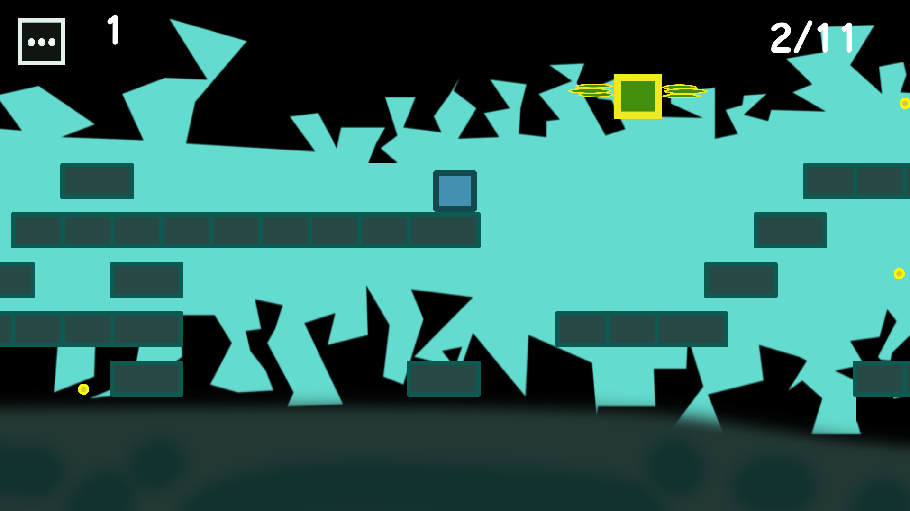
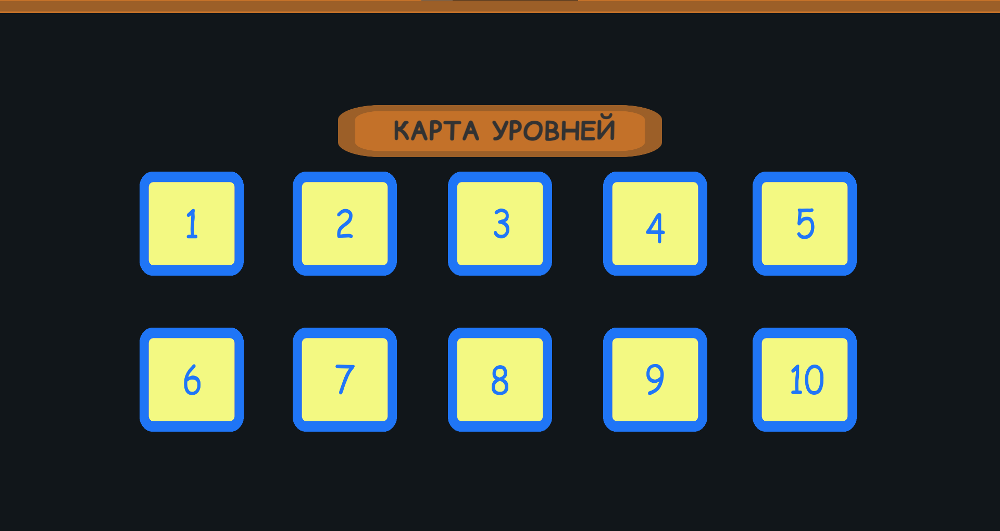

<h1 align="center"> AdventuresOfTheCube</h1>
<h2 align="center"> 2D platformer implemented on Unity as part of production practice</h2>

  

<h4 align="center"> Picture 1. Start menu </h4>

<h4 align="center"> Picture 2. Gameplay example </h4>

<h4 align="center"> Picture 3. End of gameplay</h4>

<h4 align="center"> Picture 4. About game</h4>

<h4 align="center"> Picture 5. Map of levels</h4>

<h3>To run the application, clone the repository and then run AdventuresOfTheCube.exe what is placed in the PC_build folder</h3>
